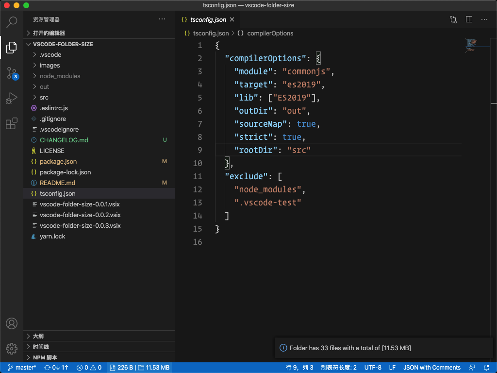

# VSCode Folder Size

[](https://marketplace.visualstudio.com/items?itemName=xiaoluoboding.vscode-folder-size)
[](https://marketplace.visualstudio.com/items?itemName=xiaoluoboding.vscode-folder-size)
[](https://github.com/xiaoluoboding/vscode-folder-size/blob/master/LICENSE)


> Shows the current file | folder size in the status bar for Visual Studio Code.

## Usage

### Counting [File | Folder] Size 

Select / Save the code file(TextDocument), Extension will counting [file | folder] size.


### Counting Number of Files in Folder

Click The [File | Folder] Status Bar, Extension will show you the number of files in the folder.



## Configuration

The Folders Not Counting, default is: `"node_modules|.git"`

```json
{
  "folder-size.ignoreFolders": "node_modules|.git"
}
```

## Changelog

[CHANGELOG](./CHANGELOG.md)

## License

MIT [@xiaoluoboding](https://github.com/xiaoluoboding)
